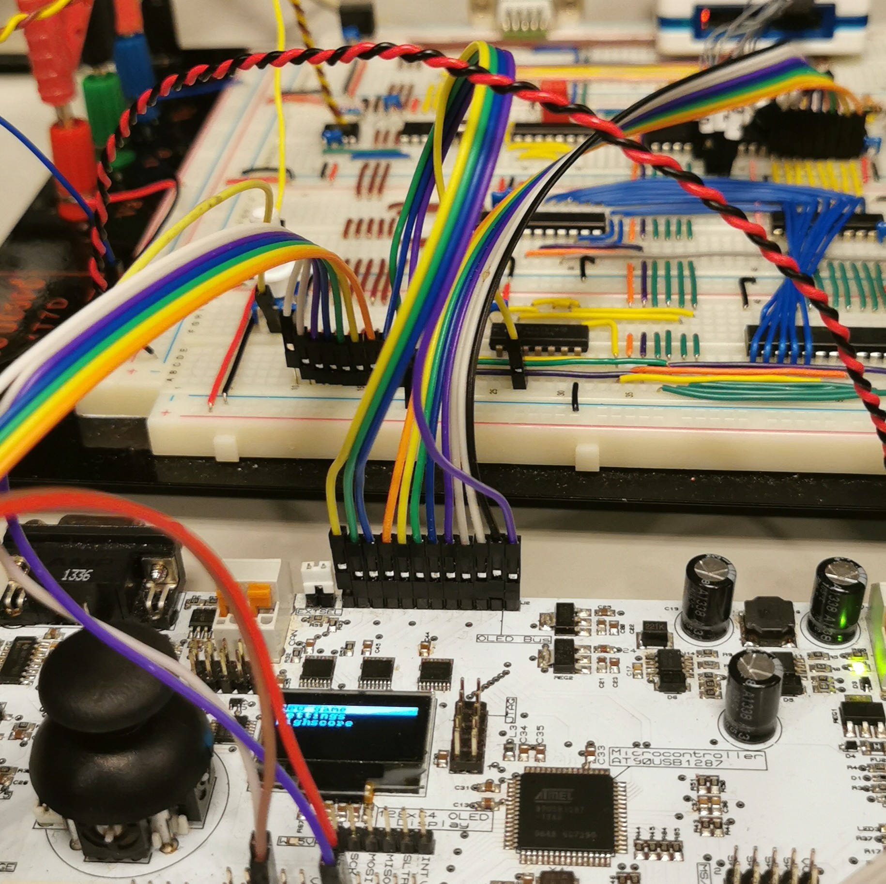

In this project we created an embedded system from scratch, connecting multiple breadboards through the use of CAN communication, implementing different controllers for our racket, securing appropriate voltage levels for different parts of the system and solutions for a graphical user interface with limited memory. As we created hardware solution for our mini-tennnis game, it was also necessary to make suitable drivers. In the end, we were able to play mini-tennis with 8-bit mario music in the backround. 

My role was both revolved around the coupling of hardware and the coding of different drivers. My main accomplishment was to create an additional controller using a gyroscope, which ended up being a better solution than a normal joystick and buttons. 

I learned that being really good at reading micro-controller documentation is a usefull skill to have. I also found how important is is to abstract away low level information in a tidy manner. To be organized and make everything as clear as possible is fundamentally important, both in regards to hardware and software design. 

You can learn more at [the projects github page](https://github.com/lassewardenaer/TTK4155-Byggern).

