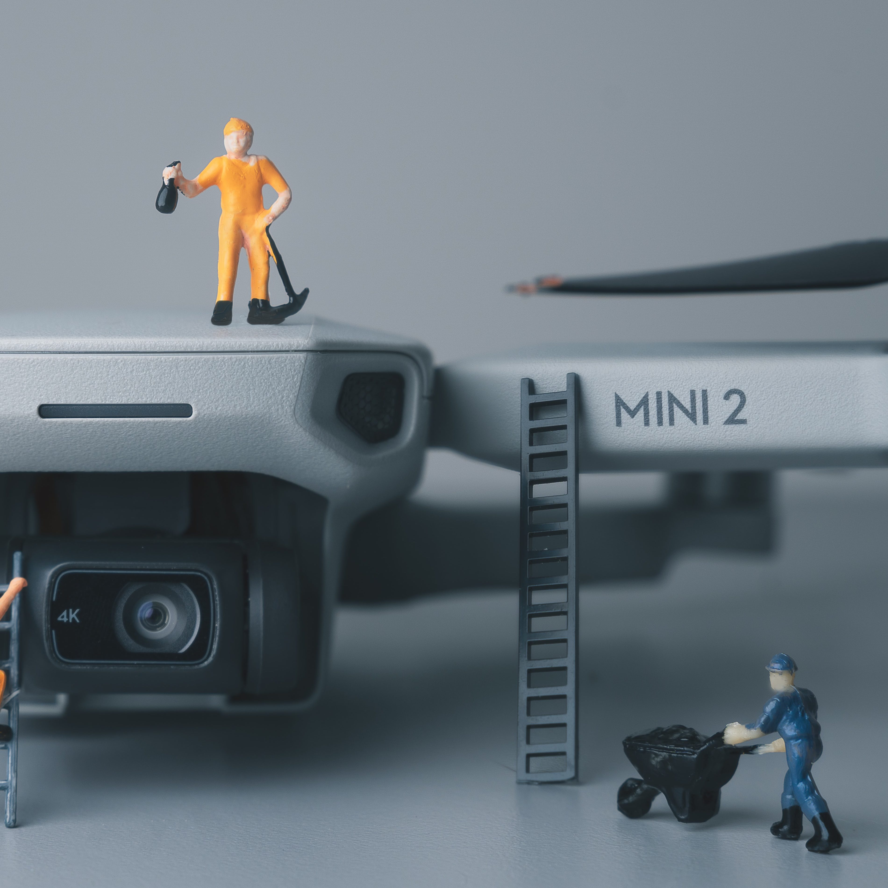

In this project we created a system for controlling a drone using a joystick. The code was written in Matlab, and by using linear systems design, we were able to control it with different kinds of sensors. While using a gyroscope, it was necessary to construct a Kalman Filter, which made the measurements less disturbed by noise. For this we needed to create an appropriate model of the system.  

My main responsibility was to create the Kalan Filter, as well as setting up the model in Matlab. I was also responsible for most of the testing and tuning og the LQ-controller.

I learned that creating a system is not allways just to follow steps in a book. To create something that is actually enjoyable to use, one has to test it in different environments, and tune the performance until it is acceptable. In addition, I saw how powerful differential equations combined with matrices could be. Also, I learned the importance of combining equipment with the right software. If, for instance, you have one sensor with less noise, you can also adjust the model, so that it becomes faster. 
