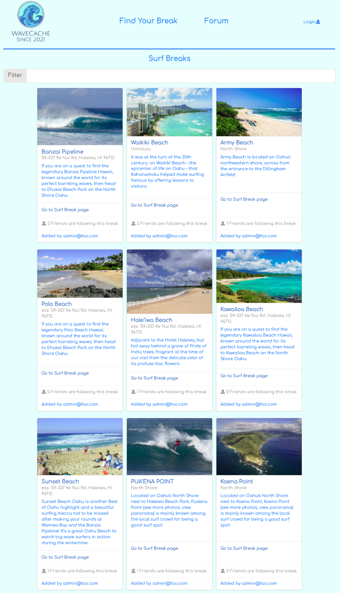

WaveCache is a project designed to list and categorize various beaches and Surfbreaks around UH Manoa and Oahu. This app could be helpful for the students who have come to UH Manoa from other places and would like to know which beaches would be ideal to surf for their skill level. The site has two roles, an administrative role as well as a basic user role. Users can view the places and add their own breaks, as well as edit and delete these, while admins can make changes to every exciting break. A user can specify skill level and get various suggestions based on this. User logs in, sets up profiles and can browse or receive suggestions. Currently, the community features are missing. 

You can create your own account by clicking on log in as one can see in the picture below. Click [here](http://www.wavecache.surf/#/surfBreaks) to reach the website.

By doing this project I learned about team development, where we used issues to measure the progress. It also brought together many different cornerstones in web development, like using React, Javascript, Meteor, APIs and UI frameworks. In addition more general concepts were practiced, like code quality and testing. 

You can find the source code for the project [here](https://github.com/wavecache/sharkbreaks).
